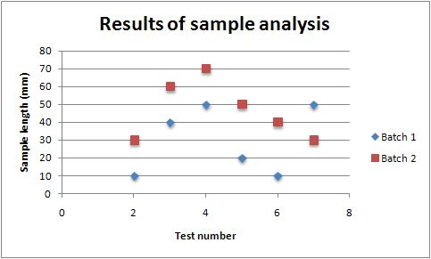

### <a name="scatter" class="anchor" href="#scatter"></a>SYNOPSIS

To create a simple Excel file with a Scatter chart using WriteXLSX:

    require 'write_xlsx'

    workbook  = WriteXLSX.new('chart.xlsx')
    worksheet = workbook.add_worksheet

    chart     = workbook.add_chart(:type => 'scatter')

    # Configure the chart.
    chart.add_series(
        :categories => '=Sheet1!$A$2:$A$7',
        :values     => '=Sheet1!$B$2:$B$7'
   )

    # Add the worksheet data the chart refers to.
    data = [
        [ 'Category', 2, 3, 4, 5, 6, 7 ],
        [ 'Value',    1, 4, 5, 2, 1, 5 ]
    ]

    worksheet.write('A1', data)

    workbook.close

### <a name="description" class="anchor" href="#description"></a>DESCRIPTION

This module implements Scatter charts for [WriteXLSX][].
The chart object is created via the Workbook `add_chart()` method:

    chart = workbook.add_chart(:type => 'scatter')

Once the object is created it can be configured via the following methods
that are common to all chart classes:

    chart.add_series
    chart.set_x_axis
    chart.set_y_axis
    chart.set_title

These methods are explained in detail in [Chart][].
Class specific methods or settings, if any, are explained below.

### <a name="column_chart_subtypes" class="anchor" href="#column_chart_subtypes"></a>Column Chart Subtypes

The `Scatter` chart module also supports the following sub-types:

    'markers_only' (the default)
    'straight_with_markers'
    'straight'
    'smooth_with_markers'
    'smooth'

These can be specified at creation time via the `add_chart()` Worksheet method:

    chart = workbook.add_chart(:type => 'scatter', :subtype => 'straight_with_markers')

### <a name="example" class="anchor" href="#example"></a>EXAMPLE

Here is a comlete example that demonstrates most of the available feature
when creating a chart.

    require 'write_xlsx'

    workbook  = WriteXLSX.new('chart_scatter.xlsx')
    worksheet = workbook.add_worksheet
    bold      = workbook.add_format(:bold => 1)

    # Add the worksheet data that the charts will refer to.
    headings = [ 'Number', 'Batch 1', 'Batch 2' ]
    data = [
        [ 2, 3, 4, 5, 6, 7 ],
        [ 10, 40, 50, 20, 10, 50 ],
        [ 30, 60, 70, 50, 40, 30 ]
    ]

    worksheet.write('A1', headings, bold)
    worksheet.write('A2', data)

    # Create a new chart object. In this case an embedded chart.
    chart = workbook.add_chart(:type => 'scatter', :embedded => 1)

    # Configure the first series.
    chart.add_series(
        :name       => '=Sheet1!$B$1',
        :categories => '=Sheet1!$A$2:$A$7',
        :values     => '=Sheet1!$B$2:$B$7'
    )

    # Configure second series. Note alternative use of array ref to define
    # ranges: [ sheetname, row_start, row_end, col_start, col_end ].
    chart.add_series(
        :name       => '=Sheet1!$C$1',
        :categories => [ 'Sheet1', 1, 6, 0, 0 ],
        :values     => [ 'Sheet1', 1, 6, 2, 2 ]
    )

    # Add a chart title and some axis labels.
    chart.set_title(:name => 'Results of sample analysis')
    chart.set_x_axis(:name => 'Test Number')
    chart.set_y_axis(:name => 'Sample length(mm)')

    # Set an Excel chart style. Colors with white outline and shadow.
    chart.set_style(10)

    # Insert the chart into the worksheet (with an offset).
    worksheet.insert_chart('D2', chart, 25, 10)

    workbook.close

This will produce a chart that looks like this:

[WriteXLSX]: index.html
[Chart]: chart.html#chart
